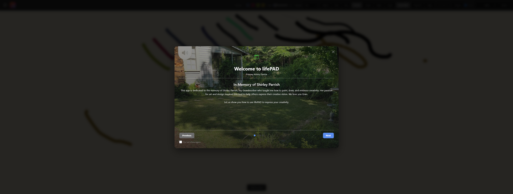
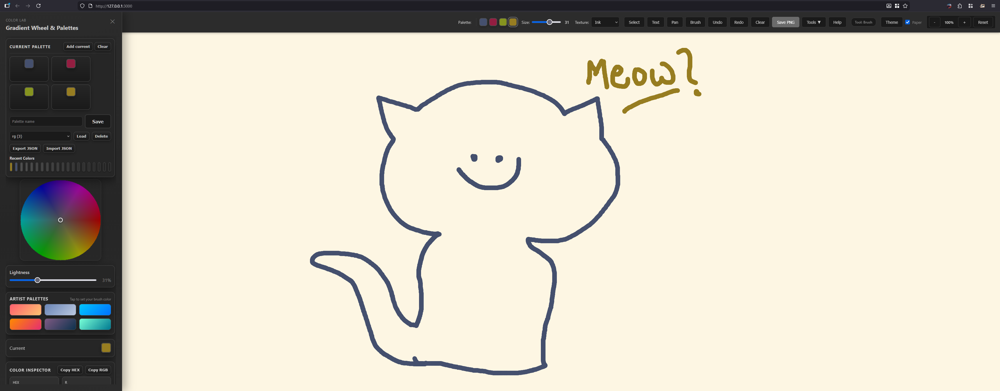

# lifePAD

Primary Artistry Device: a simple, mobile-first sketch pad for touch and stylus.

**In Memory of Shirley Parrish** — My grandmother, 1932-2026: Her guidance in painting and drawing inspired this tool and its focus on creativity.

Live: https://opensource-for-freedom.github.io/lifepad/

## What it is

lifePAD is a progressive web app for quick sketches, diagrams, and notes. It runs offline, needs no account, and keeps your work on your device. Best with a tablet and stylus, but it works everywhere.

## Core features

- Brushes and textures: ink, pencil, marker, spray, charcoal; adjustable size and opacity
- Shapes and text: common shapes plus labels for diagrams; optional rough/hand-drawn look
- Color Lab: wheel, harmony generator, gradients, recent colors, inline palette, save/load/export/import palettes (JSON), add-to-palette from gradients and harmony, quick inline palette in the navbar
- Workflow: undo/redo history, eraser, move/pan, optional paper background, light/dark themes
- Export: save as PNG or SVG; installable and offline-ready
- Privacy: no accounts, no tracking, data stays local



## Quick start
[](https://github.com/OpenSource-For-Freedom/lifepad/actions/workflows/deploy.yml)
1) Clone and enter the repo

```bash
git clone https://github.com/OpenSource-For-Freedom/lifepad.git
cd lifepad
```

2) Install and run (Node)

```bash
npm install
npm run dev
```
- The press to refresh `ctrl+shift R`

3) Open the local dev URL shown in the terminal (e.g., http://127.0.0.1:3000)

## Install as a PWA

Open the live site, then use your browser’s install/add-to-home-screen or install option:

- iOS/Safari: open the site, tap Share, then Add to Home Screen.
- Desktop Chrome/Edge: open the site, click the install icon in the address bar (or use the app’s Install button) and confirm.

After the first load, it works offline.

## License

MIT License. See LICENSE.

## Credits

In memory of Shirley Parrish, whose love of art and teaching shaped this project.
